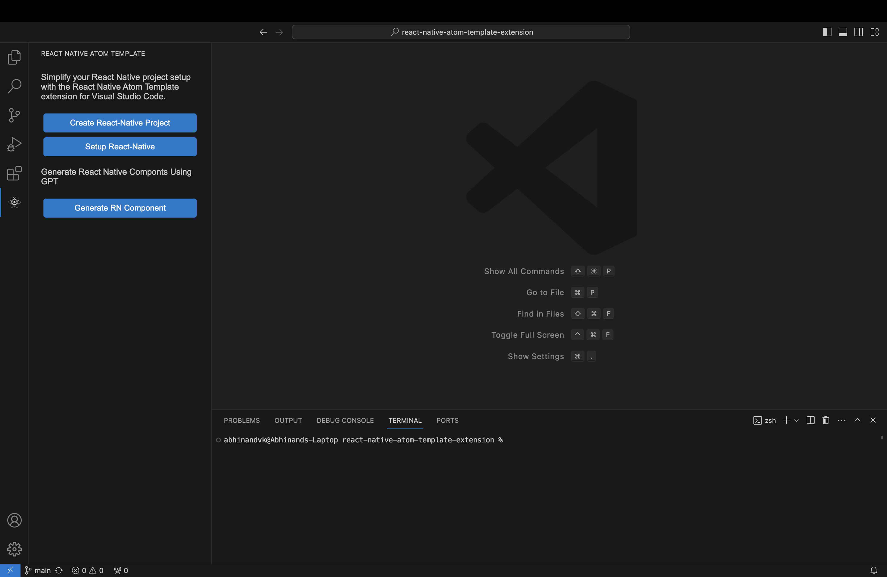

https://github.com/abhi3691/react-native-atom-template-extension/assets/54738565/8ef1d00b-02dd-474a-abd0-ef3fb824ba38
# React Native Project Creator Extension

This extension for Visual Studio Code allows you to create a new React Native project with ease using the `react-native-atom-template`.

## Features

https://github.com/abhi3691/react-native-atom-template-extension/assets/54738565/f2ff543d-b260-4f95-9d39-a0dced4d6567

### Setup React Native Project 

Use the command `react-native-atom-template.setupReactNativeProject` to setup system for run  a new React Native project  . This command will run in terminal and setup all for run react native.

### Create React Native Project

Use the command `react-native-atom-template.createReactNativeProject` to create a new React Native project. This command will prompt you to enter the name for your project, and it will then generate the project structure using the specified template.

## Requirements

Ensure you have Node.js and npm installed on your machine.

## Extension Settings

This extension doesn't contribute any additional settings.

## Known Issues

No known issues at the moment.

## Release Notes

### 0.2.8
- README  updated
### 0.2.7
- windows and linux setup added

### 0.2.5
- styles issue solved
### 0.2.3
- added Side bar

### 0.2.2
- patches

### 0.2.0

- added setup react react native feature 

### 0.1.0

- Initial release of the React Native Project Creator Extension.

---

## Following Extension Guidelines

Make sure to follow the [VS Code Extension Guidelines](https://code.visualstudio.com/api/references/extension-guidelines) for best practices in extension development.

## Working with Markdown

You can author your README using Visual Studio Code. Here are some useful editor keyboard shortcuts:

- Split the editor (`Cmd+\` on macOS or `Ctrl+\` on Windows and Linux).
- Toggle preview (`Shift+Cmd+V` on macOS or `Shift+Ctrl+V` on Windows and Linux).
- Press `Ctrl+Space` (Windows, Linux, macOS) to see a list of Markdown snippets.

## For More Information

- [Visual Studio Code's Markdown Support](http://code.visualstudio.com/docs/languages/markdown)
- [Markdown Syntax Reference](https://help.github.com/articles/markdown-basics/)

**Enjoy creating React Native projects with ease!**
