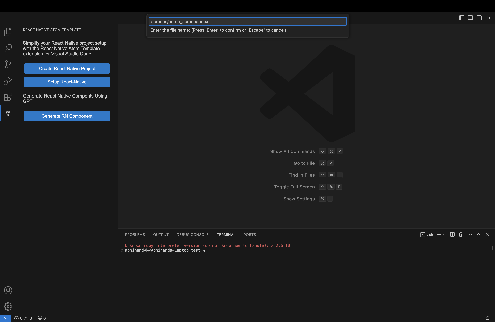
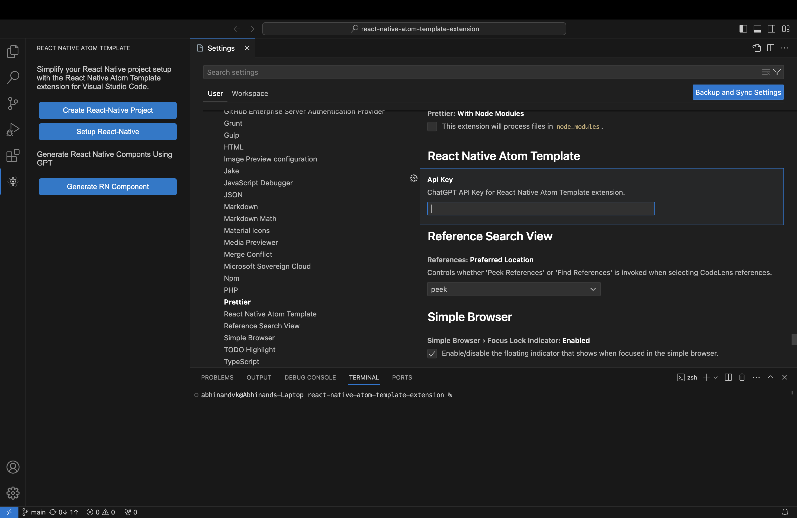
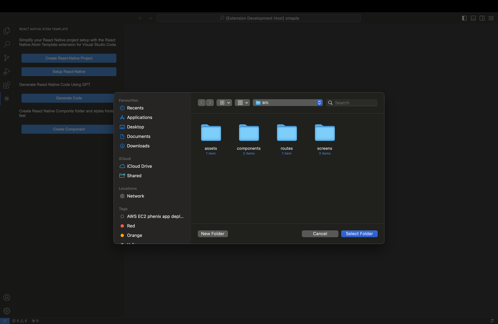
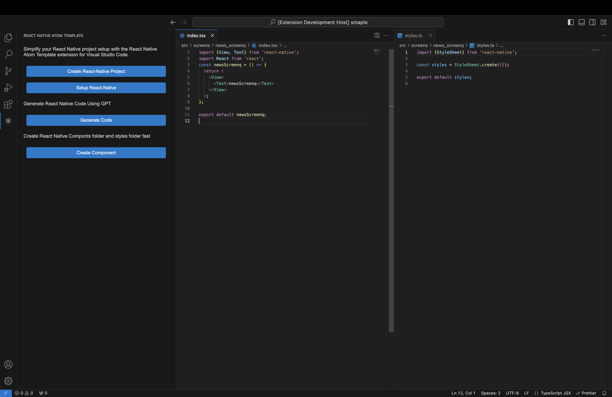

# React Native Project Creator Extension

This extension for Visual Studio Code allows you to create a new React Native project with ease using the `react-native-atom-template`.

## Features

https://github.com/abhi3691/react-native-atom-template-extension/assets/54738565/b114f1bc-d60e-4546-b017-d408429db114

### Setup React Native Project

Use the command `react-native-atom-template.setupReactNativeProject` to setup system for run a new React Native project . This command will run in terminal and setup all for run react native.

### Create React Native Project

Use the command `react-native-atom-template.createReactNativeProject` to create a new React Native project. This command will prompt you to enter the name for your project, and it will then generate the project structure using the specified template.

### Generate React Native Component

### 1. Seamless Component Generation:

Use the `react-native-atom-template.generateReactNativeApp` command to swiftly create React Native components within your project. This command automates the component creation process, saving you time and effort.

### 2. OpenAI Integration:

Easily set up your OpenAI API key through the extension settings, unlocking the full potential of OpenAI's language model. This integration enhances the component generation by leveraging advanced natural language processing capabilities.

### 3. Customization Options:

Tailor the component generation process to fit your project's specific requirements. Provide details such as file paths and additional prompts during the generation, ensuring that the created components seamlessly integrate into your project structure.

### Create React Native Component

Crate react native components fast with index.tsx and styles.ts

## Getting Started

1. **Installation:**

   - Install the extension from the Visual Studio Code Marketplace.

2. **OpenAI API Key Setup:**

   - In the extension settings, seamlessly set up your OpenAI API key to enable advanced language model integration.

3. **Component Generation:**

   - Utilize the `react-native-atom-template.generateReactNativeApp` command to initiate the seamless creation of React Native components.

## Extension Settings

- `openai.apiKey`: Your OpenAI API key for Generate Code.

## Enjoy Streamlined React Native Component Generation!

## Requirements

Ensure you have Node.js and npm installed on your machine.

## Extension Settings

This extension doesn't contribute any additional settings.

## Known Issues

No known issues at the moment.

## Release Notes

# 1.2.0

create react native components fast with pre files index.tsx and styles.ts

## 1.1.0

react native version and all npm packages are latest version all time added (latest version recact-native build requilrd jdk 17)

## 1.0.4

regerate feature added file right menu

## 1.0.3

reademe updated added OPEN AI api setup image

### 1.0.2

new create folder and file smothly

### 1.0.0

added AI Generate component

### 0.2.9

- logo updated

### 0.2.8

- README updated

### 0.2.7

- windows and linux setup added

### 0.2.5

- styles issue solved

### 0.2.3

- added Side bar

### 0.2.2

- patches

### 0.2.0

- added setup react react native feature

### 0.1.0

- Initial release of the React Native Project Creator Extension.

---
